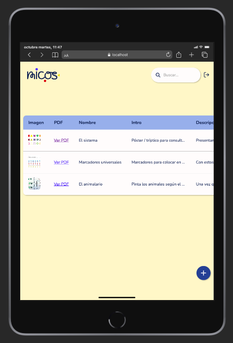
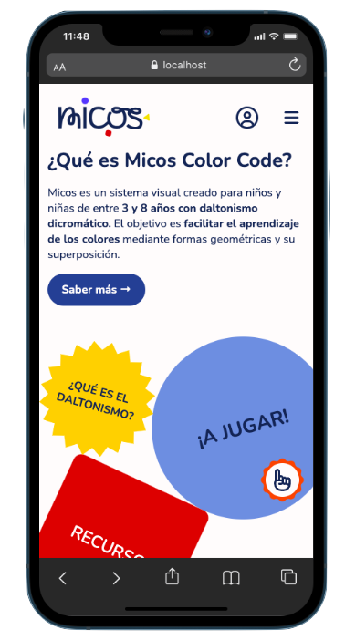
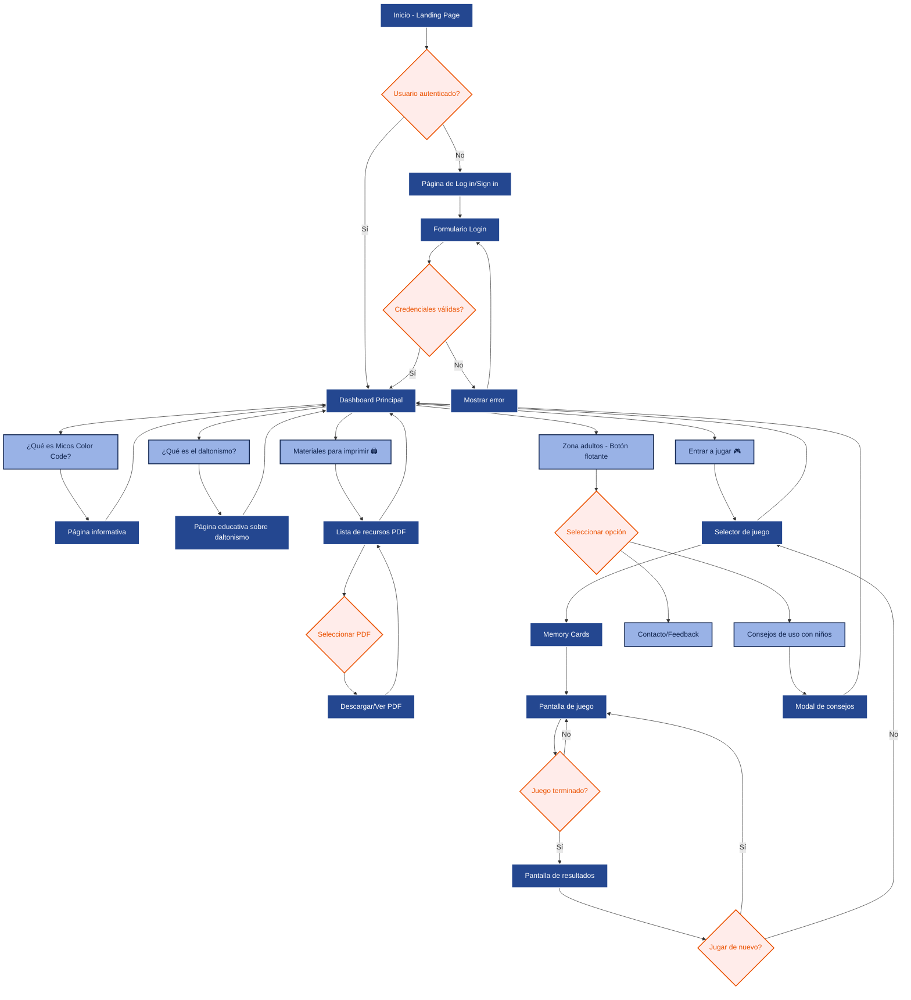
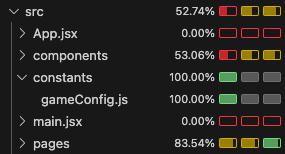

# MICOS COLOR CODE
## 🧩 Descripción
MICOS es una web (mobile-first) dirigida a niños y niñas de entre 3 y 8 años con daltonismo dicromático. Surge tras la creación del sistema visual "Micos color code", pensado para facilitar la identificación de los colores por parte de los peques con esta alteración visual. 

Con la web se pretende que mediante una forma **lúdica, visual y sencilla**, continúen con el aprendizaje también a través de las pantallas. 
<p align="left">
  
  
</p>

## 🧠 Proceso de diseño y documentación
- [Ver proceso de diseño en Figma ↗︎](https://www.figma.com/design/YueEJOk6QapJxU4PCOoqim/micos?node-id=0-1&t=ewvxFKvqEnRvRAFa-1)

- [Ver documentación del proyecto en Notion ↗︎](https://www.notion.so/sara-vazquez/MICOS-PROYECTO-FINAL-23fd5565c5b68048a775fc74e9a9f749)

## User flow


## 🛠️ Tecnologías

- React
- CSS Modules
- Fetch API para consumir el backend
- React Router para navegación

## 📦 Requisitos previos

```
- Node.js >= 22.15
- npm >= 10.9.2
- Acceso al backend del proyecto [aquí](https://github.com/sara-vazquez/micos-color-code-backend)
```

## 🚀 Instalación y ejecución

1. **Hacer un fork del repositorio**

2. **Crea una rama para tu feature/fix**
    ```
    git checkout -b feature/nueva-funcionalidad
    ````

3. **Instalar dependencias**
    [Consulta la guía de instalaciones ↗︎](https://www.notion.so/sara-vazquez/Instalaciones-front-281d5565c5b680d28ff8d736e262e840)
    ```
    npm install
    ````

4. **Haz tus cambios y crea un pull request**
    ```
    git commit -m "Descripción breve del cambio"
    git push origin feature/nueva-funcionalidad
    ````
5. **Levantar el servidor**
    ```
    npm run dev
    ```

6. **Abrir en el navegador**
    ```
    http://localhost:5173
    ```


## 📋 Funcionalidades principales del ADMIN

- **Gestión de recursos:**
  - Listar 📄
  - Añadir ➕
  - Editar ✏️
  - Eliminar 🗑
 
## 🧭 Recorridos admin y user
[](https://vimeo.com/1131261688)[](https://vimeo.com/1131261736)


## 🧪 Cobertura de tests


### Autora
Sara Vázquez
