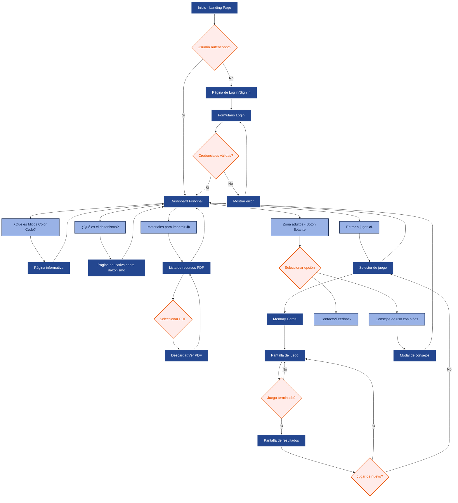

# MICOS COLOR CODE

## User flow

```mermaid
flowchart TD
    A[Inicio - Landing Page] --> B{Usuario autenticado?}
    
    B -->|No| C[Página de Log in/Sign in]
    B -->|Sí| D[Dashboard Principal]
    
    C --> C1[Formulario Login]
    C1 --> C2{Credenciales válidas?}
    C2 -->|No| C3[Mostrar error]
    C3 --> C1
    C2 -->|Sí| D
    
    D --> E[¿Qué es Micos Color Code?]
    D --> F[¿Qué es el daltonismo?]
    D --> G[Materiales para imprimir 🖨️]
    D --> H[Entrar a jugar 🎮]
    D --> I[Zona adultos - Botón flotante]
    
    E --> E1[Página informativa]
    E1 --> D
    
    F --> F1[Página educativa sobre daltonismo]
    F1 --> D
    
    G --> G1[Lista de recursos PDF]
    G1 --> G2{Seleccionar PDF}
    G2 --> G3[Descargar/Ver PDF]
    G3 --> G1
    G1 --> D
    
    H --> H1[Selector de juego]
    H1 --> H2[Memory Cards]
    H2 --> H3[Pantalla de juego]
    H3 --> H4{Juego terminado?}
    H4 -->|No| H3
    H4 -->|Sí| H5[Pantalla de resultados]
    H5 --> H6{Jugar de nuevo?}
    H6 -->|Sí| H3
    H6 -->|No| H1
    H1 --> D
    
    I --> I1{Seleccionar opción}
    I1 --> I2[Consejos de uso con niños]
    I1 --> I3[Contacto/Feedback]
    
    I2 --> I4[Modal de consejos]
    I4 --> D
    
    style A fill:#244790,stroke:#FFFFFF,stroke-width:2px,color:#FFFFFF
    style D fill:#244790,stroke:#FFFFFF,stroke-width:2px,color:#FFFFFF
    style C fill:#244790,stroke:#FFFFFF,stroke-width:2px,color:#FFFFFF
    style C1 fill:#244790,stroke:#FFFFFF,stroke-width:2px,color:#FFFFFF
    style C3 fill:#244790,stroke:#FFFFFF,stroke-width:2px,color:#FFFFFF
    style E1 fill:#244790,stroke:#FFFFFF,stroke-width:2px,color:#FFFFFF
    style F1 fill:#244790,stroke:#FFFFFF,stroke-width:2px,color:#FFFFFF
    style G1 fill:#244790,stroke:#FFFFFF,stroke-width:2px,color:#FFFFFF
    style G3 fill:#244790,stroke:#FFFFFF,stroke-width:2px,color:#FFFFFF
    style H1 fill:#244790,stroke:#FFFFFF,stroke-width:2px,color:#FFFFFF
    style H2 fill:#244790,stroke:#FFFFFF,stroke-width:2px,color:#FFFFFF
    style H3 fill:#244790,stroke:#FFFFFF,stroke-width:2px,color:#FFFFFF
    style H5 fill:#244790,stroke:#FFFFFF,stroke-width:2px,color:#FFFFFF
    style I4 fill:#244790,stroke:#FFFFFF,stroke-width:2px,color:#FFFFFF
    
    style B fill:#FFECEA,stroke:#EB5200,stroke-width:2px,color:#EB5200
    style C2 fill:#FFECEA,stroke:#EB5200,stroke-width:2px,color:#EB5200
    style G2 fill:#FFECEA,stroke:#EB5200,stroke-width:2px,color:#EB5200
    style H4 fill:#FFECEA,stroke:#EB5200,stroke-width:2px,color:#EB5200
    style H6 fill:#FFECEA,stroke:#EB5200,stroke-width:2px,color:#EB5200
    style I1 fill:#FFECEA,stroke:#EB5200,stroke-width:2px,color:#EB5200
    
    style E fill:#99B2E6,stroke:#142852,stroke-width:2px,color:#142852
    style F fill:#99B2E6,stroke:#142852,stroke-width:2px,color:#142852
    style G fill:#99B2E6,stroke:#142852,stroke-width:2px,color:#142852
    style H fill:#99B2E6,stroke:#142852,stroke-width:2px,color:#142852
    style I fill:#99B2E6,stroke:#142852,stroke-width:2px,color:#142852
    style I2 fill:#99B2E6,stroke:#142852,stroke-width:2px,color:#142852
    style I3 fill:#99B2E6,stroke:#142852,stroke-width:2px,color:#142852

```
